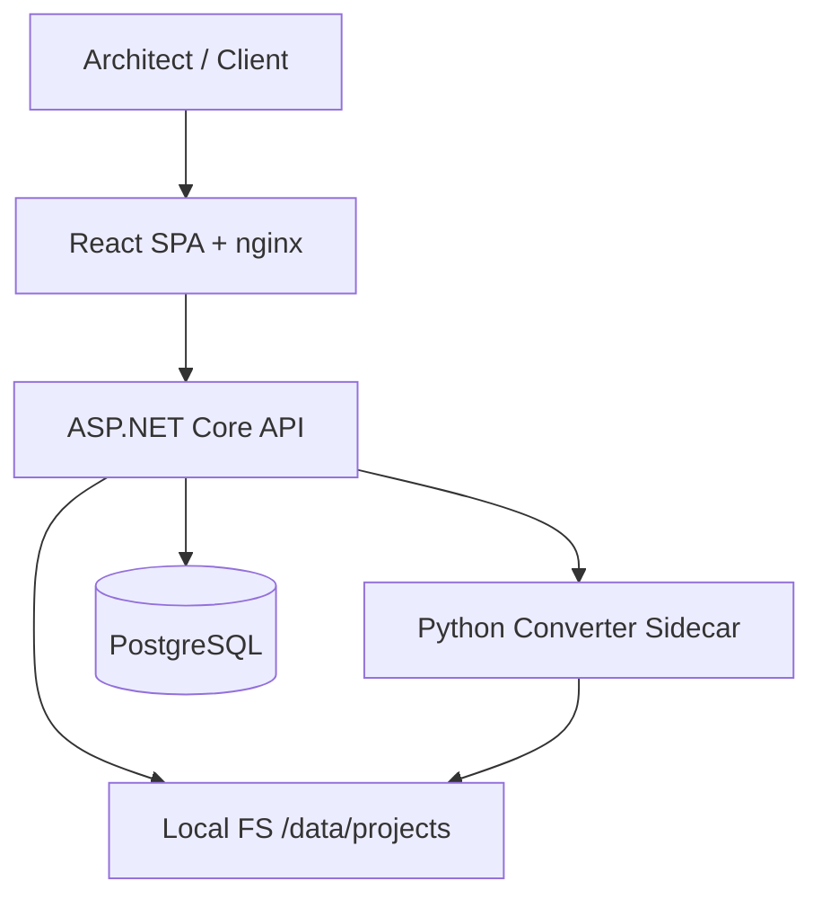
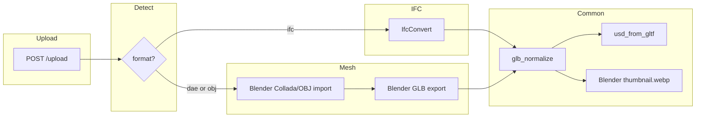

# Implementation Plan: Arch3DAR — IFC/SketchUp → Web 3D + AR MVP

**Branch**: `main` | **Date**: 2026-06-10 | **Spec**: [spec.md](spec.md)

**Input**: SpecDrive MVP simplificado (sem auth). Upload **`.ifc`**, **`.dae`**, **`.obj`**. SketchUp via Collada export (sem `.skp` direto). Conversão GLB + USDZ + thumbnail WebP, link público, AR Android + iPhone.

## Summary

Arch3DAR é uma plataforma mínima de compartilhamento 3D/AR para arquitetura (não BIM): upload de IFC ou export Collada/OBJ do SketchUp, conversão no sidecar Python único, persistência local em `/data/projects/{projectId}/`, entrega direta de assets (sem redirect), viewer web com `@google/model-viewer` e AR nativo (Scene Viewer + Quick Look).

**Pipelines**:

```
IFC:  original.ifc → IfcConvert → glb_normalize → usd_from_gltf → model.usdz
                                    └→ Blender render → thumbnail.webp

DAE:  original.dae → Blender (import Collada + export GLB) → glb_normalize → usd_from_gltf → model.usdz
                                    └→ Blender render → thumbnail.webp

OBJ:  original.obj → Blender (import Wavefront + export GLB) → glb_normalize → usd_from_gltf → model.usdz
                                    └→ Blender render → thumbnail.webp
```

**Stack**: ASP.NET Core 9, PostgreSQL 16, Python/FastAPI converter (IfcOpenShell + Blender + `usd_from_gltf`), React/Vite, nginx, Docker Compose (4 serviços, sem MinIO).

## Technical Context

**Language/Version**: C# 13 / .NET 9; TypeScript 5 / React 18 + Vite; Python 3.11; Blender 4.2 LTS (headless).

**Primary Dependencies**:
- Backend: EF Core 9 + Npgsql, Serilog, QRCoder, `LocalFileStorage`, `HttpModelConverter`, `ModelContentTypeMiddleware`.
- Frontend: `@google/model-viewer@3.3`, `react-router-dom@6`.
- Converter: IfcOpenShell `IfcConvert`, **Blender 4.2** (DAE/OBJ→GLB + thumbnail WebP), **`usd_from_gltf`**, `glb_normalize.py`, FastAPI/uvicorn.
- Infra: nginx (TLS + reverse proxy), Docker Compose.

**Storage**:
```
/data/projects/{projectId}/
  original.ifc | original.dae | original.obj
  model.glb
  model.usdz
  thumbnail.webp
```
- PostgreSQL 16: `projects` (token público, status, `source_format`, paths relativos).
- Volume Docker `project_data:/data` compartilhado entre `backend` e `converter`.

**Testing**:
- Backend integration: upload IFC + DAE → artefatos no disco → GET `/files/...` 200, Content-Type correto, sem redirect; `.skp` rejeitado com mensagem Collada.
- Converter unit: `glb_normalize`, `usd_converter`, `mesh_to_glb.py` (fixture DAE/OBJ pequeno).
- Frontend: Vitest — `ios-src`, poster WebP, upload `accept`, SketchUp instructions, admin boundary.
- Manual: quickstart §6 — AR Android + iPhone.

**Target Platform**: Linux amd64 (Docker). Clientes: Safari iOS 15+, Chrome Android 10+ (ARCore). Quick Look exige HTTPS válido.

**Project Type**: Web application (2 páginas: upload + share viewer).

**Performance Goals**:
- Upload + conversão: ≤ 5 min para arquivo ~50 MB (SC-001).
- GET `/files/...` p95 < 50 ms.
- Página pública: thumbnail + GLB < 10 s em 4G (SC-003).
- DAE/OBJ via Blender: timeout até 180 s (`MESH_CONVERSION_TIMEOUT_S`).

**Constraints**:
- Max upload 100 MB (`MAX_UPLOAD_MB`) — IFC, DAE, OBJ.
- Timeout IFC: 120 s (`IFC_CONVERSION_TIMEOUT_S`); DAE/OBJ: 180 s (`MESH_CONVERSION_TIMEOUT_S`).
- **`.skp` upload proibido** — rejeitar client (`accept`) + server com instruções SketchUp export.
- Sem redirects em URLs de assets (Quick Look).
- Content-Type: `model/gltf-binary`, `model/vnd.usdz+zip`, `image/webp`.
- USDZ obrigatório — falha = projeto `Failed`.
- HTTPS obrigatório para AR.
- Open source only — sem Forge/APS, sem addon SketchUp pago, sem ODA.

**Scale/Scope**:
- Conversão síncrona no upload (sem fila distribuída).
- Endpoints: `POST /upload`, `GET /share/{token}`, `GET /files/{id}/model.glb|model.usdz|thumbnail.webp`, `GET /share/{token}/qr`, `GET /health`.

## Constitution Check

*GATE: Must pass before Phase 0 research. Re-check after Phase 1 design.*

| Principle | Status | Evidence |
|---|---|---|
| **I. Clean Code & MVP Pragmatism** | ✅ Pass | Sidecar único; sem addon SKP frágil; DAE nativo no Blender; auth/dashboard removidos. |
| **II. Meaningful Naming & Structure** | ✅ Pass | `SourceFormat`, `DaeConverter`, `ObjConverter`, `mesh_to_glb.py`, paths espelham disco. |
| **III. Small Units & Single Responsibility** | ✅ Pass | `LocalFileStorage`, `UsdConverter`, `MeshToGlbScript`, `ThumbnailRenderer` separados no converter. |
| **IV. Tests Mirror Structure** | ✅ Pass | `app/tests/backend/Integration/`, `app/converter/test_*.py`, `app/frontend/src/__tests__/`. |
| **V. Self-Documenting Code & Minimal Comments** | ✅ Pass | Comentários só em MIME middleware e scripts Blender headless. |

**Route Boundary**: `HomePage`/`UploadPage` sem model-viewer; `SharePage` (`/s/:token`) único lugar com AR. Canary `adminBoundary.test.ts` permanece.

**Constitution re-check after Phase 1 design**: All 5 principles pass.

## Project Structure

### Documentation (this feature)

```text
specs/001-ifc-mvp-platform/
├── plan.md              # This file
├── research.md          # R-11…R-21 (storage, USDZ, DAE/OBJ, Blender, WebP)
├── data-model.md        # Project + filesystem layout
├── contracts/
│   └── openapi.md       # HTTP + converter sidecar
├── quickstart.md        # E2E IFC + DAE + AR checklist
└── spec.md
```

### Source Code (repository root)

```text
app/
├── backend/
│   ├── Domain/
│   │   ├── Project.cs              # SourceFormat (Ifc|Dae|Obj)
│   │   └── SourceFormat.cs
│   ├── Infrastructure/
│   │   ├── LocalFileStorage.cs
│   │   ├── ModelContentTypeMiddleware.cs   # + image/webp
│   │   ├── HttpModelConverter.cs           # passes sourceFormat to sidecar
│   │   ├── QrCodeService.cs
│   │   └── CorrelationIdMiddleware.cs
│   ├── Services/
│   │   ├── IFileStorageService.cs
│   │   ├── IModelConversionService.cs      # abstraction FR-010
│   │   └── IPublicLinkService.cs
│   └── Program.cs
│
├── converter/
│   ├── converter_service.py        # routes by format
│   ├── ifc_pipeline.py             # IfcConvert path
│   ├── mesh_to_glb.py              # Blender: DAE/OBJ → GLB (replaces skp_to_glb.py)
│   ├── mesh_pipeline.py            # DAE/OBJ orchestration (replaces skp_pipeline.py)
│   ├── render_thumbnail.py         # Blender → thumbnail.webp
│   ├── glb_normalize.py
│   ├── usd_converter.py
│   ├── requirements.txt
│   └── Dockerfile                  # Blender 4.2 LTS (stock — no SKP addon)
│
├── frontend/
│   └── src/
│       ├── pages/
│       │   ├── HomePage.tsx        # upload .ifc | .dae | .obj + SketchUp guide
│       │   └── SharePage.tsx       # model-viewer + AR
│       └── components/
│           └── ModelViewer.tsx
│
├── docker-compose.yml              # postgres, converter, backend, frontend+nginx
└── tests/
    ├── backend/Integration/
    └── frontend/
```

**Structure Decision**: Mantém `app/{backend,frontend,converter,tests}/`. Um sidecar `converter` com IfcOpenShell + Blender + USDZ. Volume `/data` compartilhado.

## Architecture

### System context



### Conversion flow



### Backend services (interfaces)

| Interface | Responsibility |
|---|---|
| `IFileStorageService` | CRUD paths under `/data/projects/{id}/` |
| `IModelConversionService` | Detect format, invoke converter sidecar, update status |
| `IPublicLinkService` | Generate token, share URL, QR SVG |

## Implementation Phases

### Phase A — IFC correction (verified)

IFC E2E com Quick Look iPhone + storage local. Baseline de produção.

### Phase B — DAE/OBJ support (SketchUp workflow)

1. **Remover** `skp_to_glb.py` / pipeline SKP (`io_sketchup`, `import_scene.skp`).
2. Implementar `mesh_to_glb.py` (Blender batch: `bpy.ops.wm.collada_import` + `bpy.ops.wm.obj_import` → export glTF binary; addon `io_scene_collada` habilitado em runtime).
3. Estender `POST /convert` com `sourceFormat` (`ifc`|`dae`|`obj`).
4. Backend: `SourceFormat` enum; validação magic bytes DAE/OBJ; rejeitar `.skp` com mensagem Collada; upload UI `accept=".ifc,.dae,.obj"`.
5. Frontend: instruções SketchUp export prominentes (FR-001a).
6. Testes: fixture DAE exportada do SketchUp + integration upload DAE; teste rejeição `.skp`.

### Phase C — Thumbnail WebP (in progress)

1. `render_thumbnail.py` (Blender headless) para todos os formatos.
2. `thumbnail.webp` / `image/webp` em middleware e frontend poster.
3. Atualizar testes e quickstart.

## Complexity Tracking

Nenhuma violação da constituição. Blender no sidecar justificado por: (1) DAE/OBJ→GLB com materiais, (2) thumbnail WebP unificado. **Não** instalar addon SketchUp — stock Blender 4.2 já importa Collada/OBJ.

## Migration from current state (ordered)

1. **IFC correction** ✅: local storage, `usd_from_gltf`, `glb_normalize`, sem MinIO, `ios-src`.
2. **Spec alignment** (this plan): DAE/OBJ substituem SKP em spec, plan, contracts, data-model.
3. **Backend**: `SourceFormat` → `Ifc|Dae|Obj`; remover `Skp`; validação DAE (XML `COLLADA`) e OBJ (`#`/`v `); rejeição `.skp` dedicada.
4. **Converter**: substituir `skp_pipeline.py`/`skp_to_glb.py` por `mesh_pipeline.py`/`mesh_to_glb.py`; renomear `SKP_CONVERSION_TIMEOUT_S` → `MESH_CONVERSION_TIMEOUT_S`.
5. **Frontend**: `accept=".ifc,.dae,.obj"`; bloco SketchUp export guide; remover referências `.skp`.
6. **Tests + quickstart**: cenários DAE/OBJ; rejeição SKP; AR checklist para IFC + DAE.
7. **Cleanup**: deletar código morto `io_sketchup`; atualizar `SkpUploadConversionTests` → `DaeUploadConversionTests`.

## Acceptance Criteria

1. Upload `.ifc`, `.dae`, ou `.obj` via `POST /upload` ou HomePage.
2. Upload `.skp` rejeitado (client `accept` + server 415 com instruções Collada).
3. Artefatos em `/data/projects/{id}/`: original, `model.glb`, `model.usdz`, `thumbnail.webp`.
4. Share URL + QR gerados automaticamente ao `Ready`.
5. Viewer web: orbit, zoom, fullscreen, auto-rotate, poster WebP.
6. Android AR (Scene Viewer) funciona.
7. iPhone AR (Quick Look via USDZ) funciona sem "Object could not be opened".
8. DAE/OBJ do SketchUp: cores/texturas reconhecíveis no viewer (SC-009, best-effort).
9. Zero MinIO; assets servidos diretamente (200, Content-Type correto, sem redirect).
10. `docker compose up` sobe stack completa com Blender + IfcOpenShell — **sem** addon SKP.
