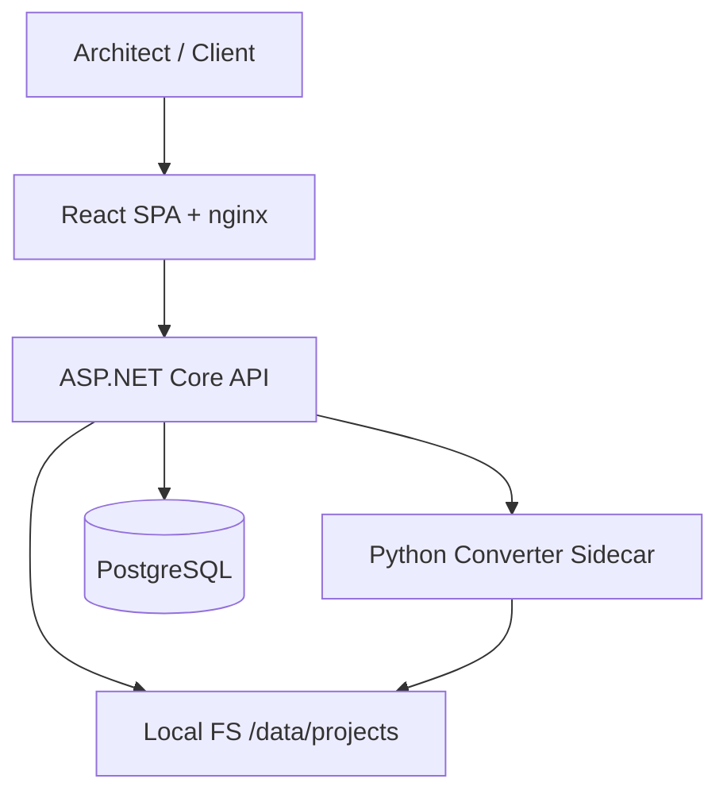
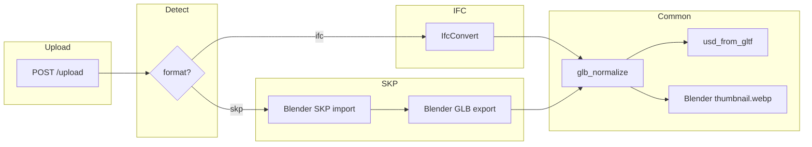

# Implementation Plan: Arch3DAR — IFC/SKP → Web 3D + AR MVP

**Branch**: `main` | **Date**: 2026-06-10 | **Spec**: [spec.md](spec.md)

**Input**: SpecDrive sobre correção ativa — MVP simplificado (sem auth), upload `.ifc` ou `.skp`, conversão GLB + USDZ + thumbnail WebP, link público, AR Android + iPhone.

## Summary

Arch3DAR é uma plataforma mínima de compartilhamento 3D/AR para arquitetura (não BIM): upload de IFC ou SKP, conversão no sidecar Python único, persistência local em `/data/projects/{projectId}/`, entrega direta de assets (sem redirect), viewer web com `@google/model-viewer` e AR nativo (Scene Viewer + Quick Look).

**Pipelines**:

```
IFC:  original.ifc → IfcConvert → glb_normalize → usd_from_gltf → model.usdz
                                    └→ Blender render → thumbnail.webp

SKP:  original.skp → Blender (import SKP + export GLB) → glb_normalize → usd_from_gltf → model.usdz
                                    └→ Blender render → thumbnail.webp
```

**Stack**: ASP.NET Core 9, PostgreSQL 16, Python/FastAPI converter (IfcOpenShell + Blender + `usd_from_gltf`), React/Vite, nginx, Docker Compose (4 serviços, sem MinIO).

## Technical Context

**Language/Version**: C# 13 / .NET 9; TypeScript 5 / React 18 + Vite; Python 3.11; Blender 4.2 LTS (headless).

**Primary Dependencies**:
- Backend: EF Core 9 + Npgsql, Serilog, QRCoder, `LocalFileStorage`, `HttpModelConverter`, `ModelContentTypeMiddleware`.
- Frontend: `@google/model-viewer@3.3`, `react-router-dom@6`.
- Converter: IfcOpenShell `IfcConvert`, **Blender 4.2** (SKP→GLB + thumbnail WebP), **`usd_from_gltf`**, `glb_normalize.py`, FastAPI/uvicorn.
- Infra: nginx (TLS + reverse proxy), Docker Compose.

**Storage**:
```
/data/projects/{projectId}/
  original.ifc | original.skp
  model.glb
  model.usdz
  thumbnail.webp
```
- PostgreSQL 16: `projects` (token público, status, `source_format`, paths relativos).
- Volume Docker `project_data:/data` compartilhado entre `backend` e `converter`.

**Testing**:
- Backend integration: upload IFC + SKP → artefatos no disco → GET `/files/...` 200, Content-Type correto, sem redirect.
- Converter unit: `glb_normalize`, `usd_converter`, `skp_to_glb` (fixture SKP pequeno).
- Frontend: Vitest — `ios-src`, poster WebP, admin boundary.
- Manual: quickstart §6 — AR Android + iPhone.

**Target Platform**: Linux amd64 (Docker). Clientes: Safari iOS 15+, Chrome Android 10+ (ARCore). Quick Look exige HTTPS válido.

**Project Type**: Web application (2 páginas: upload + share viewer).

**Performance Goals**:
- Upload + conversão: ≤ 5 min para arquivo ~50 MB (SC-001).
- GET `/files/...` p95 < 50 ms.
- Página pública: thumbnail + GLB < 10 s em 4G (SC-003).
- SKP via Blender: timeout estendido aceitável até 180 s (env `SKP_CONVERSION_TIMEOUT_S`).

**Constraints**:
- Max upload 100 MB (`MAX_UPLOAD_MB`) — IFC e SKP.
- Timeout IFC: 120 s (`IFC_CONVERSION_TIMEOUT_S`); SKP: 180 s (`SKP_CONVERSION_TIMEOUT_S`).
- Sem redirects em URLs de assets (Quick Look).
- Content-Type: `model/gltf-binary`, `model/vnd.usdz+zip`, `image/webp`.
- USDZ obrigatório — falha = projeto `Failed`.
- HTTPS obrigatório para AR.
- Open source only — sem Forge/APS.

**Scale/Scope**:
- Conversão síncrona no upload (sem fila distribuída).
- Endpoints: `POST /upload`, `GET /share/{token}`, `GET /files/{id}/model.glb|model.usdz|thumbnail.webp`, `GET /share/{token}/qr`, `GET /health`.

## Constitution Check

*GATE: Must pass before Phase 0 research. Re-check after Phase 1 design.*

| Principle | Status | Evidence |
|---|---|---|
| **I. Clean Code & MVP Pragmatism** | ✅ Pass | Sidecar único evita microserviços por formato. Auth/dashboard removidos. Blender só entra onde SKP exige. |
| **II. Meaningful Naming & Structure** | ✅ Pass | `SourceFormat`, `SkpConverter`, `IfcConverter`, paths espelham disco. |
| **III. Small Units & Single Responsibility** | ✅ Pass | `LocalFileStorage`, `UsdConverter`, `SkpToGlbScript`, `ThumbnailRenderer` separados no converter. |
| **IV. Tests Mirror Structure** | ✅ Pass | `app/tests/backend/Integration/`, `app/converter/test_*.py`, `app/frontend/src/__tests__/`. |
| **V. Self-Documenting Code & Minimal Comments** | ✅ Pass | Comentários só em MIME middleware e scripts Blender headless. |

**Route Boundary**: `HomePage`/`UploadPage` sem model-viewer; `SharePage` (`/s/:token`) único lugar com AR. Canary `adminBoundary.test.ts` permanece.

**Constitution re-check after Phase 1 design**: All 5 principles pass.

## Project Structure

### Documentation (this feature)

```text
specs/001-ifc-mvp-platform/
├── plan.md              # This file
├── research.md          # R-11…R-20 (storage, USDZ, SKP, Blender, WebP)
├── data-model.md        # Project + filesystem layout
├── contracts/
│   └── openapi.md       # HTTP + converter sidecar
├── quickstart.md        # E2E IFC + SKP + AR checklist
└── spec.md
```

### Source Code (repository root)

```text
app/
├── backend/
│   ├── Domain/
│   │   ├── Project.cs              # + SourceFormat (Ifc|Skp)
│   │   └── ProjectStatus.cs
│   ├── Infrastructure/
│   │   ├── LocalFileStorage.cs
│   │   ├── ModelContentTypeMiddleware.cs   # + image/webp
│   │   ├── HttpModelConverter.cs           # passes sourceFormat to sidecar
│   │   ├── QrCodeService.cs
│   │   └── CorrelationIdMiddleware.cs
│   ├── Services/
│   │   ├── IFileStorageService.cs
│   │   ├── IModelConversionService.cs      # abstraction FR-010
│   │   ├── IThumbnailService.cs            # contract (implemented in converter)
│   │   └── IPublicLinkService.cs
│   └── Program.cs
│
├── converter/
│   ├── converter_service.py        # routes by format
│   ├── ifc_pipeline.py             # IfcConvert path
│   ├── skp_to_glb.py               # Blender headless script
│   ├── render_thumbnail.py         # Blender → thumbnail.webp
│   ├── glb_normalize.py
│   ├── usd_converter.py
│   ├── requirements.txt
│   └── Dockerfile                  # + Blender 4.2 LTS
│
├── frontend/
│   └── src/
│       ├── pages/
│       │   ├── HomePage.tsx        # upload .ifc | .skp
│       │   └── SharePage.tsx       # model-viewer + AR
│       └── components/
│           └── ModelViewer.tsx
│
├── docker-compose.yml              # postgres, converter, backend, frontend+nginx
└── tests/
    ├── backend/Integration/
    └── frontend/
```

**Structure Decision**: Mantém `app/{backend,frontend,converter,tests}/`. Um sidecar `converter` com IfcOpenShell + Blender + USDZ. Volume `/data` compartilhado.

## Architecture

### System context



### Conversion flow



### Backend services (interfaces)

| Interface | Responsibility |
|---|---|
| `IFileStorageService` | CRUD paths under `/data/projects/{id}/` |
| `IModelConversionService` | Detect format, invoke converter sidecar, update status |
| `IThumbnailService` | Contract for thumbnail generation (delegated to converter) |
| `IPublicLinkService` | Generate token, share URL, QR SVG |

## Implementation Phases

### Phase A — IFC correction (in progress)

Completar correção Quick Look iPhone + storage local (ver Migration below). Garantir IFC E2E antes de SKP.

### Phase B — SKP support

1. Adicionar Blender 4.2 LTS ao Dockerfile do converter.
2. Implementar `skp_to_glb.py` (Blender batch: import SKP → export glTF binary).
3. Estender `POST /convert` com campo `sourceFormat` (`ifc`|`skp`).
4. Backend: validação magic bytes SKP, `SourceFormat` column, aceitar `.skp` no upload UI.
5. Testes: fixture SKP mínimo + integration upload SKP.

### Phase C — Thumbnail WebP

1. Substituir Pillow/IfcConvert thumbnail por `render_thumbnail.py` (Blender headless).
2. Migrar endpoints e middleware para `thumbnail.webp` / `image/webp`.
3. Atualizar testes e quickstart.

## Complexity Tracking

Nenhuma violação da constituição. Blender no sidecar é justificado pela clarificação SpecDrive (SKP→GLB direto + thumbnail único).

## Migration from current state (ordered)

1. **IFC correction** (em andamento): local storage, `usd_from_gltf`, `glb_normalize`, sem MinIO, `ios-src`.
2. **Backend**: `SourceFormat` enum; upload aceita `.skp`; validação signature; `MAX_UPLOAD_MB`.
3. **Converter Dockerfile**: instalar Blender 4.2 LTS + dependências SKP (libGL, Xvfb opcional).
4. **Converter code**: `ifc_pipeline.py`, `skp_to_glb.py`, `render_thumbnail.py`; router em `converter_service.py`.
5. **Thumbnail migration**: `thumbnail.png` → `thumbnail.webp` em paths, middleware, frontend poster.
6. **Frontend**: file input `accept=".ifc,.skp"`; mensagens de erro por formato.
7. **Tests + quickstart**: cenários SKP; AR checklist para ambos formatos.

## Acceptance Criteria

1. Upload `.ifc` ou `.skp` via `POST /upload` ou HomePage.
2. Artefatos em `/data/projects/{id}/`: original, `model.glb`, `model.usdz`, `thumbnail.webp`.
3. Share URL + QR gerados automaticamente ao `Ready`.
4. Viewer web: orbit, zoom, fullscreen, auto-rotate, poster WebP.
5. Android AR (Scene Viewer) funciona.
6. iPhone AR (Quick Look via USDZ) funciona sem "Object could not be opened".
7. SKP com materiais/texturas: cores reconhecíveis no viewer (SC-009, best-effort).
8. Zero MinIO; assets servidos diretamente (200, Content-Type correto, sem redirect).
9. `docker compose up` sobe stack completa com Blender + IfcOpenShell.
